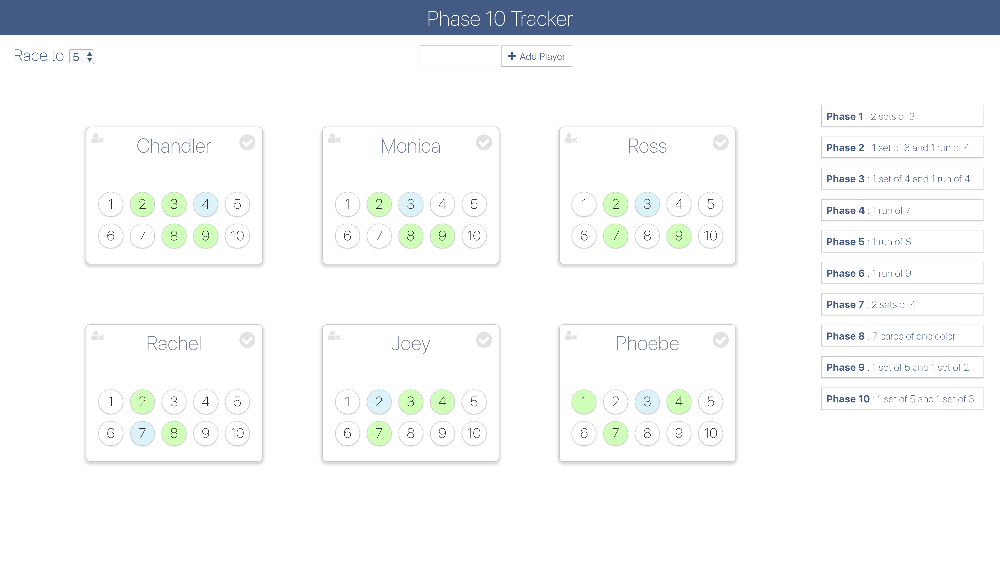

# Phase Keeper

_Keep track of your phases in a Phase 10 gameplay, instead of using pen and paper. Add players, track their completed phases and calls!_

 

## Tracking

- Add players and set the race number. First person to complete the race number of phases will win
- Click on a phase number for a given player to indicate their call in a round
- Calls would be indicated by blue background
- When a player wins a round, click on the check mark for the corresponding player
- This will mark the winning phase as green for the winning player and clear the calls for rest of the players

## Setup

From the root directory, run commands:

    npm install

    npm start
